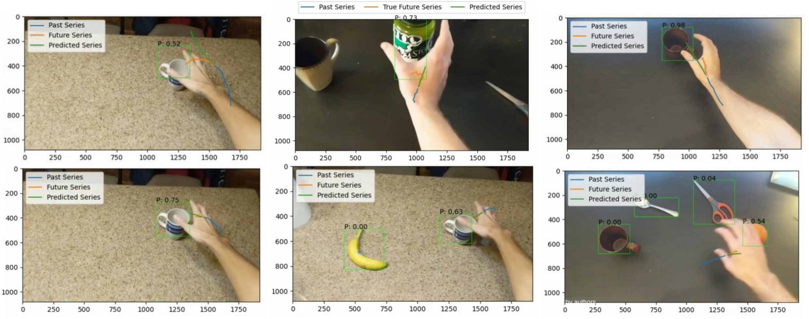

# Egocentric Prediction of Hand-Object Interaction

This project uses first-person video to predict hand-object contact using a MaskRCNN for object detection and LSTM for trajectory prediction. Also see the [project report](https://www.luisjguzman.com/media/Csci5561/Project_Report__Egocentric_Prediction_of_Hand_Object_Interaction.pdf) and [project video](https://youtu.be/nKqXu4bZbFY).

The main functions can be run with `python run_on_video/run_on_video.py`.
